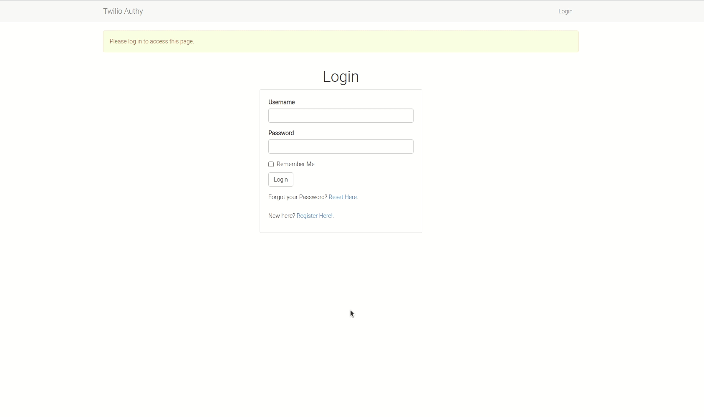
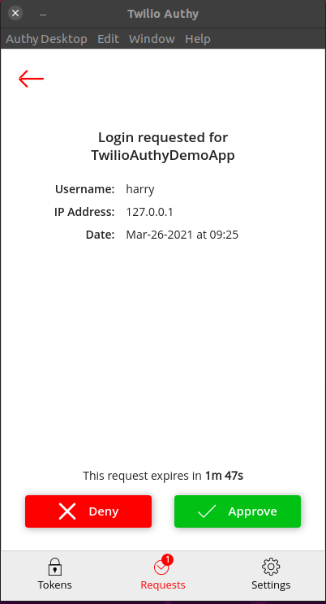

# Enable Push Notification in Flask Using Python and Twilio Authy



Push notifications is another way to enable optional two-factor authentication in a user's account. This method is far less intrusive compared to the two other methods covered previously:

* [Mandatory one-time password authentication](https://github.com/GitauHarrison/how-to-implement-time-based-two-factor-auth-in-flask)
* [Two-factor authentication using Twilio Verify](https://github.com/GitauHarrison/twilio-verify-2fa-implementation-in-flask)

### Features

* Password-based authentication
* Optional two-factor authentication

### Tools Used

* Twilio Authy API to enable two-factor authentication
* Flask login for password-based authentication
* Flask web framework
* Flask bootstrap for styling and cross-browser responsiveness
* Flask WTF for creation of secure web forms
* Flask sqlalchemy for database creation
* Flask migrate to handle database migrations
* Email Validator to validate emails
* Flask moment for pretty timestamps
* qrcode to generate QR Codes
* pyjwt for token generation
* pyngrok for localhost testing

### Project  Design

* [Elaborate Push 2FA project design](https://www.figma.com/proto/yup5WjYWXFWS2z2Yrwj84d/Twilio-2fa-Push-Notifcation?node-id=1%3A2&scaling=min-zoom&page-id=0%3A1)

### Requirements
* Smartphone
* [Authy](https://authy.com/) app

### Deployed Application

* [TwilioAuthyDemoApp](https://push-notifications-2fa.herokuapp.com/)

### Testing Deployed Application

1. Click [Register](https://push-notifications-2fa.herokuapp.com/auth/register)
2. [Log in](https://push-notifications-2fa.herokuapp.com/auth/login?next=%2F) yourself
3. Go to the _Profile_ page
4. Click on [Enable two-factor authentication](https://push-notifications-2fa.herokuapp.com/auth/2fa/enable) link
5. [Download](https://authy.com/download/) the [Authy](https://authy.com/) app
6. Click the _Enable 2fa_ button and follow the instructions
7. You have just enabled two-factor authentication for your account!
8. Click _Logout_ on the top-right of the navbar
9. [Log in](https://push-notifications-2fa.herokuapp.com/auth/login?next=%2F) yourself again
10. Check the notification on your [Authy](https://authy.com/) app.
11. Click _Approve_ or _Deny_



### Testing Application Locally

* Create a [free Twilio account](https://www.twilio.com/try-twilio?promo=WNPWrR) now
* Click on [Twilio Console](https://www.twilio.com/console)
* Click on "All Products and Services" on the menu on the far left
* Click [Authy](https://www.twilio.com/console/authy)
* Click  "Create Application" button
* Provide a name for your application and click _Create_ button
* From _Settings_, you will see _Application Name_, _Application ID_ and _Production API Key_. Save these somewhere safe for later.

1. Clone this repository:

```python
$ git clone git@github.com:GitauHarrison/push-notification-2fa-in-python-and-flask.git
```

2. Move into the cloned directory:

```python
$ cd push-notification-2fa-in-python-and-flask
```

3. Create and activate your virtual environment:

```python
$ mkvirtualenv twilio_authy
```

4. Install all the dependencies used in this application:

```python
(twilio_authy)$ pip3 freeze > requirements.txt
```

5. Before you can run your server, remember to create a `.env` file following the guidance seen in the `.env-template`. Create a `.env` file in the root directory:

```python
(twilio_authy)$ touch .env
```

6. Update the `.env` file with all the necessary details. Remember to add your _Application Name_, _Application ID_ and _Production API Key_ codes:

```python
AUTHY_APP_NAME=
AUTHY_APP_ID=
AUTHY_PRODUCTION_API_KEY=
```

7. Run the flask server:

```python
(twilio_authy)$ flask run
```

Once your application is running, you can access your localhost on http://127.0.0.1:5000/. Additionally, if you look carefully in your terminal, you will see:` * Tunnel URL: NgrokTunnel: "http://4209c9af6d43.ngrok.io" -> "http://localhost:5000"`

The HTTP value may be different from the one shown here because I am using the free tier package of `ngrok`. Paste the link http://4209c9af6d43.ngrok.io on another device, say your mobile phone, to test the application while it is on localhost.

Another way to obtain `ngrok`'s free public URLs would be to run the command below in a new terminal window:

```python
(twilio_authy)$ ngrok http 5000

# Output

ngrok by @inconshreveable                               (Ctrl+C to quit)
                                                                        
Session Status                online                                    
Session Expires               1 hour, 58 minutes                        
Version                       2.3.35                                    
Region                        United States (us)                        
Web Interface                 http://127.0.0.1:4042                     
Forwarding                    http://6e95e59c2233.ngrok.io -> http://loc
Forwarding                    https://6e95e59c2233.ngrok.io -> http://lo
                                                                        
Connections                   ttl     opn     rt1     rt5     p50     p9
                              0       0       0.00    0.00    0.00    0.
```

Note the lines beginning with 'Forwarding'. These show the public URLs that `ngrok` uses to redirect requests into our service. This method provides you with `https://`.

1. Click _Register_ to create a new user
2. _Log in_ the user
3. Go to the _Profile_ page
4. Click on _Enable two-factor authentication_ link
5. [Download](https://authy.com/download/) the [Authy](https://authy.com/) app
6. Click the _Enable 2fa_ button and follow the instructions
7. You have just enabled two-factor authentication for your account!
8. Click _Logout_ on the top-right of the navbar
9. _Log in_ the user again
10. Check the notification on your [Authy](https://authy.com/) app.
11. Click _Approve_ or _Deny_


### Build it Yourself

If you would like to incorporate this feature, try it out by creating your own project. You can follow this [push notification in flask](https://github.com/GitauHarrison/notes/blob/master/two_factor_authentication/twilio_authy.md) guide.

### Reference

* This application assumes that you have a basic understanding of python and Flask. If not, start [here](https://github.com/GitauHarrison/notes/blob/master/web_development/personal_blog/personal_blog.md).
* If you do not know what the command `mkvirtualenv` is, learn more [here](https://github.com/GitauHarrison/notes/blob/master/virtualenvwrapper_setup.md).